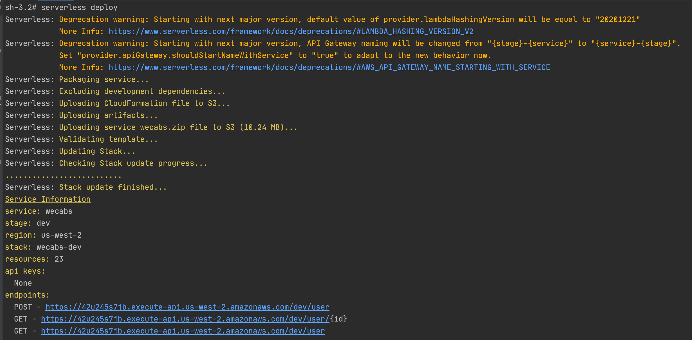

# wecabs-backend

# DB:
### 1- USER

      name
      profileImgUrl
      email 
      phone 
      userId
      carsBooked
      carsAvailable
      carsDetails
      submittedAt
      password 
      updatedAt
      role
      location
      bookingsCount
      avgRating
      approvalStatus
      imagesNames
      balance
            
### 2- BOOKING
        
      bookingId
      pickupPoint
      dropPoint
      pickupTime
      carType
      expiryTime
      distance
      customerDetails
      allottedBidId
      status
      basePrice
      maxPrice
      minPrice
      reviewCollected
      companyReceivableAmount
      notes
      tripType
      location
      allottedUserId
      
### 3- BID

      bidId
      linkedUserId
      linkedUserRating
      linkedBookingId
      amount
      carPlate
      submittedAt 
      updatedAt  
      status 
      
### 4- CAR
       
      carPlate
      linkedUserId
      carManufactureYear
      carDetails
      imagesNames
      
# Api:

## 1- user (db)
```
POST USER - post a new user
GET USER - get details of a specific user
LIST USER - list a user
```
## 2- booking (db)
```
POST BOOKING - for posting booking details
GET BOOKING - for getting details of a specific booking
LIST BOOKING - list all bookings
LIST BOOKING -BY USERID
```

## 3- bid (db)
```
POST BID
GET BID
LIST BID
LIST BID BY BOOKINGID
LIST BID BY USERID
```

## 4- car (db)
```
POST CAR
GET CAR
LIST CAR
LIST CAR BY USERID
``` 
 
SERVERLESS DEPLOY
```
serverless deploy
```

