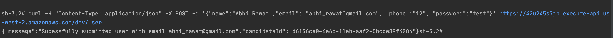

# wecabs-backend
sample api call (user/put)



TODO:

Api:

1- registration (db)
get call - pass/username is good /not
Put call - create user, profile

Get profile - json


2- Booking api (db)

Get call (one way) - 4 json
Put call ( mark done, bidding) - true 
Get call (driver) - specific bookings , with status 

3- Availability (db)

Put call - submit data 

```
endpoints:
  POST - https://42u245s7jb.execute-api.us-west-2.amazonaws.com/dev/user
  GET - https://42u245s7jb.execute-api.us-west-2.amazonaws.com/dev/user/{id}
  GET - https://42u245s7jb.execute-api.us-west-2.amazonaws.com/dev/user
```


